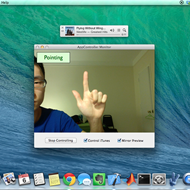
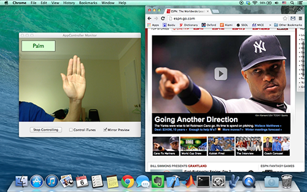

# AppController

Every time when you try to pause/play iTunes on your Mac, you may feel it annoying to bring the iTunes to the foreground, aim the mouse cursor to the triangle button, and press it. Or when you are doing a presentation, you simply do not want to bring a remote with you to control the keynote. To simplify app controlling experience, I designed an OS X app, the AppController, which can assist users to control other apps by detecting their gestures through the built-in iSight camera. AppController utilizes the Gesture Detector to recognize three kinds of gestures – fist, palm, and pointing, based on a trained generic gesture model. The gesture detector predicts a gesture by extracting the histogram of gradients (HOG) descriptors of an image, and uses support vector machine (SVM) to classify.

The AppController consists of two parts: the higher level (AppController UI) which captures image and sends controlling signal to other apps, and the lower level (the Gesture Detector) which classifies the gesture in an image. The figure above shows how these two parts are combined and how the AppController works. Specifically, the AppController UI captures images through the built-in Mac iSight camera; it passes single images to the Gesture Detector; the Gesture Detector extracts the HOG descriptors of an image, and uses the trained gesture SVM model to classify gestures; the Gesture Detector passes the gesture decision to the AppController UI; and the AppController UI is able to trigger App controlling signal by the decision.

The AppController is designed to control numbers of apps, including iTunes, Safari, Google Chrome, iWorks, Microsoft Office, Adobe Reader, etc. The two snapshots above show that I play iTunes and that I scroll down a Chrome webpage respectively.

[Demo video](https://youtu.be/K0aSkdeiMOM)
